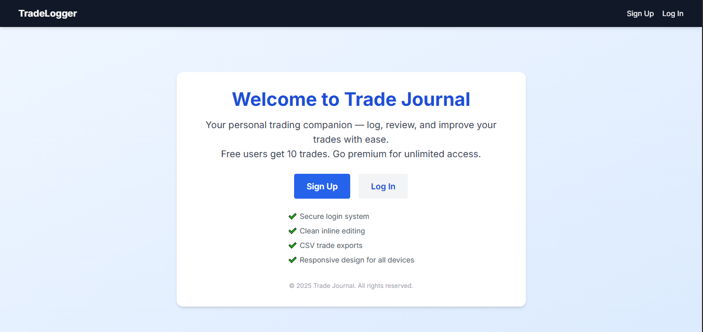
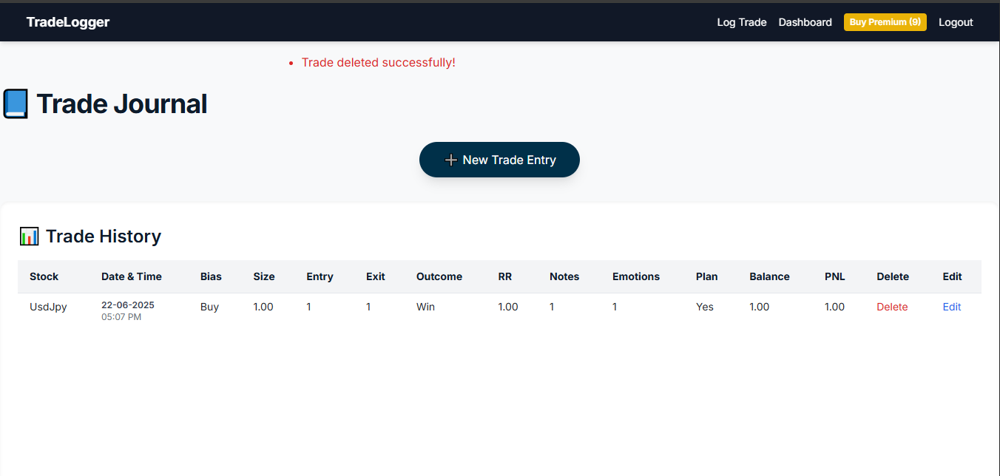
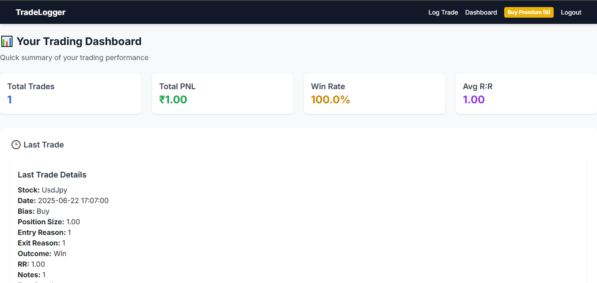
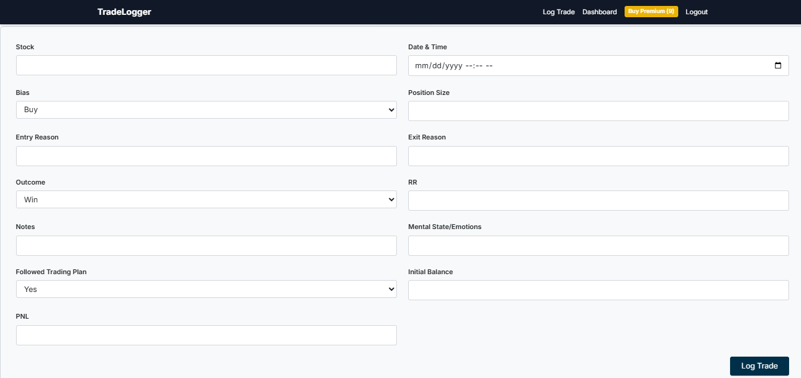
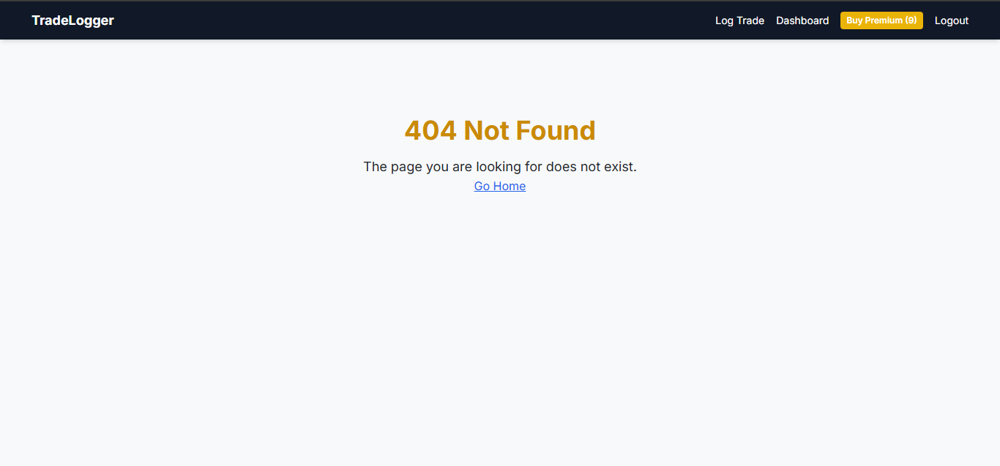
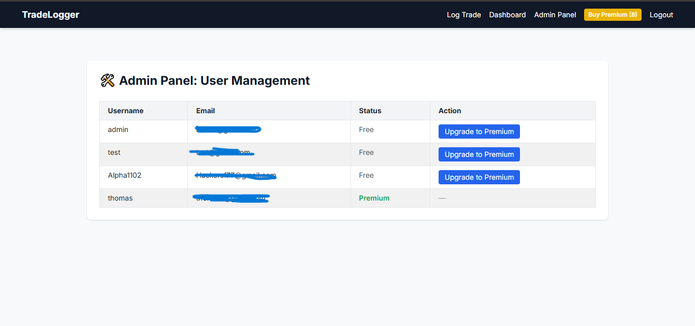

# 📈 TradeLog – Trading Journal SaaS (Flask)

**TradeLog** is a modern SaaS web application for traders to log, review, and improve their trading performance. Built with Flask, it offers a secure, user-friendly platform to manage trade journals, analyze patterns, and upgrade to premium features with ease.

---

## 💭 Why I Built TradeLog

As a former trader and current developer, I set out to build a platform that would help me reflect on past trades, understand my mindset, and grow over time. What began as a personal tool evolved into TradeLog — a scalable SaaS built to help traders cultivate discipline and consistency.

---

## 🚀 Features

- 🔐 **User Authentication** – Secure registration, login, and logout using Flask-Login and Flask-Bcrypt.
- 🧾 **Trade Logging** – Add, inline edit, and delete trades with detailed fields: Stock, Date & Time, Bias, Position Size, Entry/Exit Reason, Outcome, R:R, Notes, Emotion, Plan, Balance, PNL.
- 💡 **Free vs Premium**: Free users can log up to 10 trades. Premium users get unlimited trades + CSV export.
- 💳 **Premium Upgrade** – Integrated **Cashfree** payment gateway for smooth upgrades.
- 📤 **CSV Export** – Premium users can export trades for analysis.
- ⚙️ **Admin Panel** – Manage users and view registered accounts.
- ❌ **Custom Error Pages** – Friendly 403, 404, and 500 error templates.
- 🎨 **Responsive UI** – Built with Tailwind CSS for a modern, clean, mobile-first design.
- 🧱 **Blueprint Architecture** – Modular codebase with clear separation (`auth`, `main`, `trading`, `errors`).
- 🗄️ **Database** – SQLAlchemy ORM with SQLite (default).
- ☁️ **Deployment Ready** – Easily deployable on Render.com or any WSGI-compatible host.

---

## 📸 Screenshots

**Landing Page**  


**Home / Index**  


**Dashboard**  


**Trade Form**  


**Error Pages**  


**Admin Panel**  


---

## 🛠️ Getting Started

### ✅ Prerequisites

- Python 3.8+
- `pip` (Python package manager)

### 📦 Installation

1. **Clone the repository:**
   ```bash
   git clone git clone https://github.com/aqeel-sheikh/tradelog.git

   cd tradelog
   ```
2. **Create a virtual environment:**
   ```bash
   python -m venv venv
   source venv/bin/activate  # On Windows: venv\Scripts\activate
   ```
3. **Install dependencies:**
   ```bash
   pip install -r requirements.txt
   ```
4. **Set environment variables:**
   Create a `.env` file in the root directory:
   ```ini
   SECRET_KEY=your-secret-key
   CASHFREE_APP_ID=your-cashfree-app-id
   CASHFREE_SECRET_KEY=your-cashfree-secret
   CASHFREE_STAGE=TEST  # or PRODUCTION
   DATABASE_URL=sqlite:///tradelog.db  # Optional for local use
   ```
5. **Run the app locally:**
   ```bash
   python run.py
   ```
   Then visit [http://localhost:5000](http://localhost:5000)

### 🌐 Deployment (Render.com)

1. Push your code to GitHub.
2. Create a new Web Service on Render.
3. Set the start command:
   ```bash
   gunicorn run:app
   ```
4. Add the environment variables from your `.env` file in the Render dashboard.

## 📁 Project Structure
```
tradelog/
├── auth/
├── errors/
├── main/
├── trading/
├── templates/
├── static/
├── models.py
├── extensions.py
├── config.py
├── __init__.py
run.py
requirements.txt
.env (not committed)
```

## ⚙️ Configuration
- All configuration is managed in `config.py`.
- Sensitive data (like keys and passwords) should be stored in environment variables, not hardcoded.

## 🙋‍♂️ Usage
- Register or log in.
- Add, edit, or delete trades from your dashboard.
- Upgrade to premium for unlimited trades and CSV export.
- Admins can manage users via the admin panel.

## 🤝 Contributing
Pull requests are welcome! For major changes, open an issue first to discuss what you’d like to contribute.

## 👤 Author
- Aqeel Sheikh  
  GitHub: [@aqeel-sheikh](https://github.com/aqeel-sheikh)  
  📧 sheikhakeelw01@gmail.com

## 📄 License
This project is licensed under the [MIT License](LICENSE)

---

_TradeLog – Your personal trading companion._